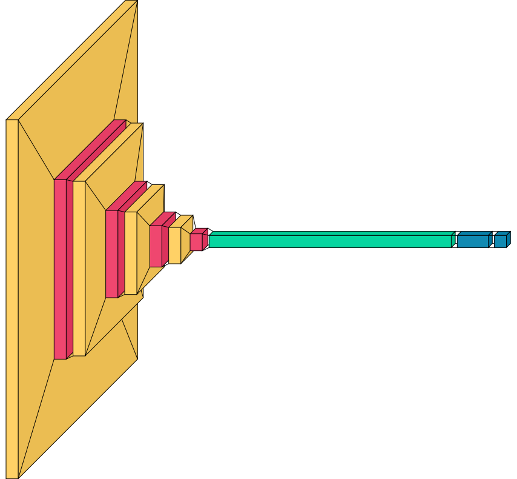

# Retinal Defect Classifier powered by Deep Learning
Automated way to detect and classify retinal diseases using Deep Learning (Convolutional Neural Network).

<h2> Objective </h2>

Given a new OCT image, determine whether the images belong to which 4 classes: CNV, DRUSEN, DME and NORMAL. We are using CNN for classification model.

<h2> Dataset Description </h2>

The dataset is organized into 3 folders (train, test, val) and contains subfolders for each image category (NORMAL,CNV,DME,DRUSEN). There are 84,495 X-Ray images (JPEG) and 4 categories (NORMAL,CNV,DME,DRUSEN).

Images are labeled as (disease)-(randomized patient ID)-(image number by this patient) and split into 4 directories: CNV, DME, DRUSEN, and NORMAL.

Optical coherence tomography (OCT) images (Spectralis OCT, Heidelberg Engineering, Germany) were selected from retrospective cohorts of adult patients from the Shiley Eye Institute of the University of California San Diego, the California Retinal Research Foundation, Medical Center Ophthalmology Associates, the Shanghai First People’s Hospital, and Beijing Tongren Eye Center between July 1, 2013 and March 1, 2017.

<h2> Model Details <h2>

A convolutional neural network was used with alternating 2D convolutions and max pooling layers.

<h2> Results </h2>

The model is tested using the test data and it returns an Accuracy of 96.88%. This project discusses about the most accurate and fastest method to detect the retinal defects and sort using CNN. This method will be very useful when incorporated in OCT machine so that the time taken to diagnose the defect can be decreased and the Doctors can do the required procedure. The accuracy of this method can be increased by adding more training data and also increasing the number of epochs.

<h2> Acknowledgements </h2>

Dataset : https://www.kaggle.com/paultimothymooney/kermany2018  
Citation : http://www.cell.com/cell/fulltext/S0092-8674(18)30154-5
